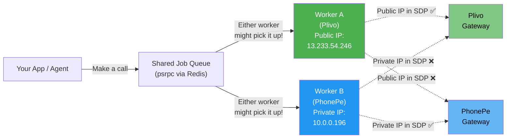
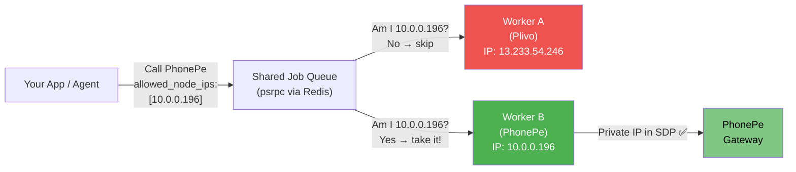
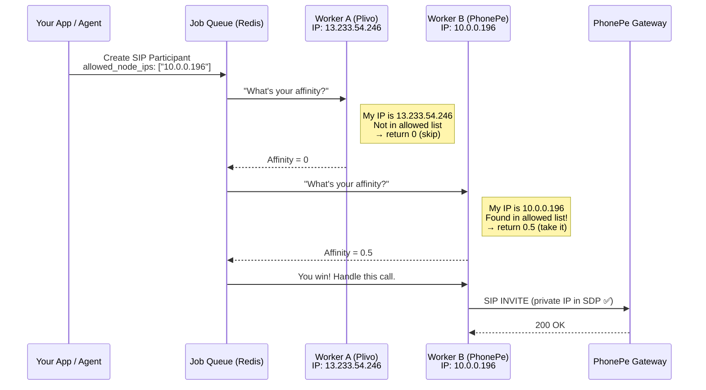
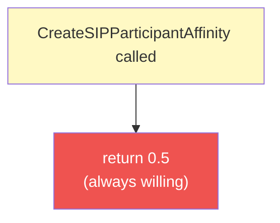
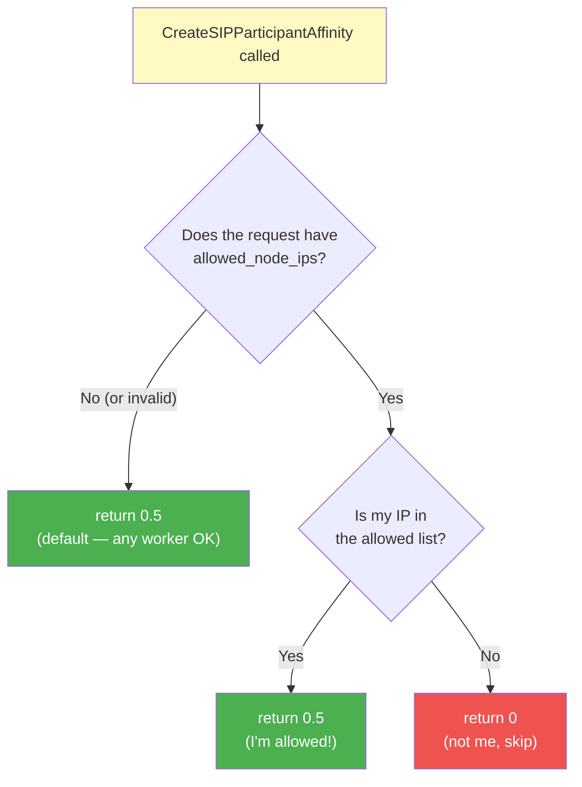
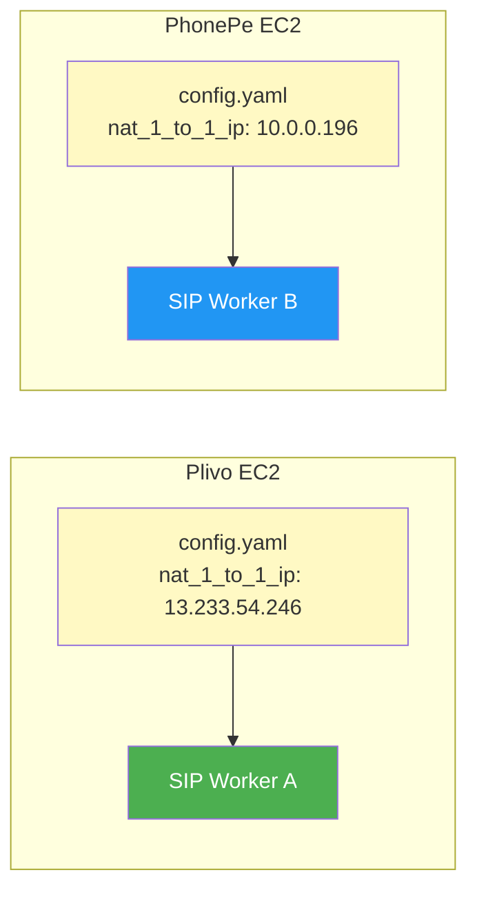
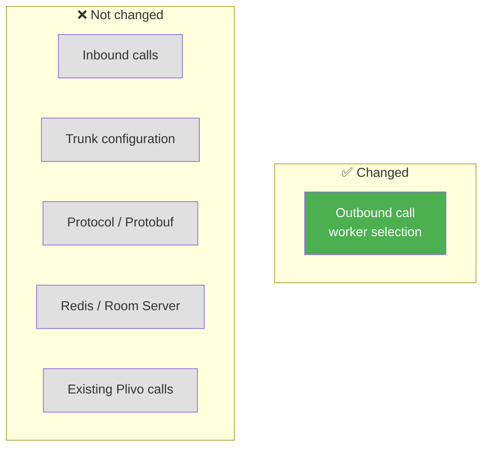

# SIP Worker Affinity — IP-Based Call Routing

## The Problem (In Plain English)

Imagine you have two phone-line workers (SIP servers) sitting in the same office (shared Redis + LiveKit Room Server):

- **Worker A (Plivo)** — talks to the outside world using a **public IP** (`13.233.54.246`)
- **Worker B (PhonePe)** — talks over a **private VPN tunnel** using a **private IP** (`10.0.0.196`)

When someone says "make a call to PhonePe", **either worker might pick up the job** — there's no filter. If Worker A picks it up, it tells PhonePe "hey, connect to my public IP", but PhonePe's firewall blocks public IPs. The call fails.



**The wrong worker picks up the call → wrong IP in SDP → call fails.**

---

## The Solution

We added a simple filter: when making a call, you say **"only workers with THIS IP should handle it"**. Workers that don't match simply say "not me" (return affinity `0`), and the job goes to the right worker.



---

## How It Works Step by Step



---

## The Code Change Explained

We modified one function and added one helper in [service.go](../pkg/sip/service.go).

### Before (every worker always says "I can do it")



Every worker returned `0.5` no matter what → any worker could pick up any call.

### After (workers check if they're allowed)



### Key behaviors

| Scenario | What happens | Affinity |
|---|---|---|
| No `allowed_node_ips` in request | Any worker can pick it up (backwards compatible) | `0.5` |
| `allowed_node_ips` present, worker IP matches | This worker takes the call | `0.5` |
| `allowed_node_ips` present, worker IP doesn't match | This worker opts out | `0` |
| `allowed_node_ips` is malformed JSON | Treated as "no filter" (safe fallback) | `0.5` |

---

## How to Use It (Caller / Agent Side)

When your app creates an outbound SIP call, pass the `allowed_node_ips` attribute to target specific workers.

### Target the PhonePe worker only

```python
await lk_api.sip.create_sip_participant(
    api.CreateSIPParticipantRequest(
        sip_trunk_id="phonepe-trunk-id",
        sip_call_to="+91XXXXXXXXXX",
        room_name=ctx.room.name,
        participant_identity="phonepe-participant",
        participant_attributes={
            "allowed_node_ips": '["10.0.0.196"]'
        }
    )
)
```

### Target the Plivo worker only

```python
await lk_api.sip.create_sip_participant(
    api.CreateSIPParticipantRequest(
        sip_trunk_id="plivo-trunk-id",
        sip_call_to="+1XXXXXXXXXX",
        room_name=ctx.room.name,
        participant_identity="plivo-participant",
        participant_attributes={
            "allowed_node_ips": '["13.233.54.246"]'
        }
    )
)
```

### Allow either worker (backwards compatible)

Simply don't include `allowed_node_ips` — works exactly like before.

```python
await lk_api.sip.create_sip_participant(
    api.CreateSIPParticipantRequest(
        sip_trunk_id="any-trunk-id",
        sip_call_to="+1XXXXXXXXXX",
        room_name=ctx.room.name,
        participant_identity="any-participant"
        # no allowed_node_ips → any worker picks it up
    )
)
```

---

## Worker Configuration

Each SIP worker's config file tells it what IP to use. The affinity function reads this IP to decide "am I the right worker?"



```yaml
# Plivo EC2 config
nat_1_to_1_ip: 13.233.54.246

# PhonePe EC2 config
nat_1_to_1_ip: 10.0.0.196
```

---

## What's NOT Affected



- **Inbound calls** — use a completely different path (`GetAuthCredentials` + `DispatchCall`), untouched
- **Trunk config** — no new fields needed on `SIPOutboundTrunkInfo`
- **Protocol/Protobuf** — no changes to `livekit/protocol`
- **Redis, Room Server, Egress** — completely untouched
- **Existing Plivo calls** — if you don't pass `allowed_node_ips`, behavior is identical to before

---

## Test Coverage

We added 14 unit tests covering both the helper function and the affinity logic:

| Test Group | Cases | What it validates |
|---|---|---|
| `TestGetAllowedNodeIPs` (7 tests) | nil attrs, empty attrs, missing key, empty value, invalid JSON, single IP, multiple IPs | The JSON parsing helper handles every edge case gracefully |
| `TestCreateSIPParticipantAffinity` (7 tests) | no filter, matching IP, non-matching IP, match in list, no match in list, bad JSON fallback, empty value fallback | The affinity function returns the right score in every scenario |
